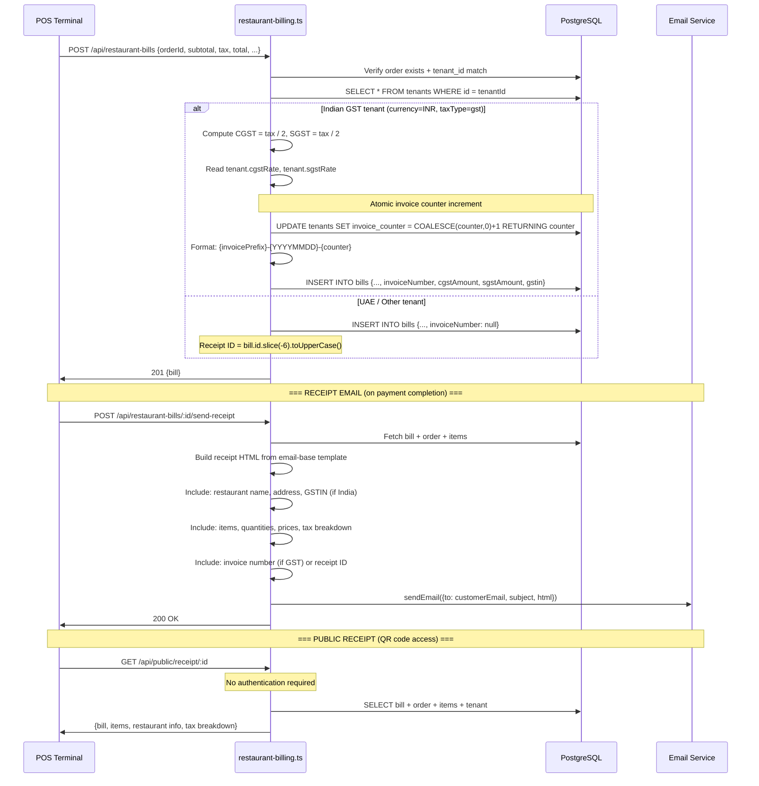

# Flow 5 — Invoice Generation

## Narrative

Invoice generation is integrated into bill creation at `POST /api/restaurant-bills`. For Indian GST tenants (`currency === "INR" && taxType === "gst"`), the server atomically increments `tenants.invoiceCounter` and generates a sequential invoice number. Tax is split into CGST/SGST using tenant-level rates. For UAE/other tenants, **no formal invoice number is generated** — bills use a truncated UUID as a receipt identifier. There is no standalone invoice generation endpoint; invoices are always created as a side effect of billing. E-invoicing (GST e-way bill, UAE FTA) is not implemented.

## Sequence Diagram

## Files Involved

| Step | File | Function / Line | DB Table(s) |
|------|------|----------------|-------------|
| Bill creation | `server/routers/restaurant-billing.ts` | Lines 209-371 | `bills` (insert), `tenants` (update counter) |
| GST detection | `server/routers/restaurant-billing.ts` | Line 281 | `tenants` (read) |
| Invoice counter increment | `server/routers/restaurant-billing.ts` | Lines 297-301 | `tenants` (atomic update) |
| CGST/SGST split | `server/routers/restaurant-billing.ts` | Lines 282-295 | — |
| Receipt email | `server/routers/restaurant-billing.ts` | Lines 1209-1305 | `bills`, `orders`, `order_items`, `tenants` (read) |
| Email template | `server/templates/email-base.ts` | — | — |
| Public receipt | `server/routers/restaurant-billing.ts` | Lines 127-170 | `bills`, `orders`, `order_items`, `tenants` (read) |
| Currency config | `shared/currency.ts` | `CURRENCIES`, `formatCurrency()` | — |
| Bill number gen | `server/storage.ts` | Lines 2668-2693 | `bills` (tx with retry) |

## tenant_id Checks

| Operation | tenant_id Checked | Method |
|-----------|-------------------|--------|
| Bill creation | Yes | `storage.getOrder(orderId, user.tenantId)` |
| Invoice counter | Yes | `WHERE id = user.tenantId` |
| Receipt email | Yes | Bill fetched with tenant scope |
| Public receipt | **No auth** | Bill by UUID (acceptable) |

## Transactions / Atomicity

| Operation | Transaction | Notes |
|-----------|-------------|-------|
| Invoice counter increment | Yes (atomic SQL) | `UPDATE ... SET counter = counter + 1 RETURNING` — safe under concurrency |
| Bill number generation | Yes (Drizzle tx with retry) | `SELECT MAX + INSERT` with unique violation retry — safe |
| Bill creation (overall) | **NO** | Bill insert + packing charge insert are separate |

## Tax Calculation Detail

### India GST
- **Source:** `tenant.cgstRate`, `tenant.sgstRate` (decimal columns on tenants table)
- **Calculation:** `cgstAmount = taxAmount / 2`, `sgstAmount = taxAmount / 2` (equal split, lines 282-295)
- **GSTIN:** Stored on `tenants.gstin`, included on receipts
- **Missing:** IGST (inter-state), HSN code on invoice line items (hsnCode exists on menuItems but not propagated to bills), place of supply logic

### UAE VAT
- **Source:** Generic `tenant.taxRate` (no UAE-specific fields)
- **Calculation:** Applied as a flat rate to subtotal
- **TRN:** `outlets.taxRegistrationNumber` exists but is NOT included on bills/receipts
- **Missing:** FTA-compliant invoice format, sequential invoice number, e-invoicing

### Receipt Fields

| Field | GST Invoice | UAE Receipt | Notes |
|-------|------------|-------------|-------|
| Invoice number | `{prefix}-{YYYYMMDD}-{counter}` | Not generated | UAE FTA requires sequential |
| GSTIN | Included | N/A | |
| TRN | Not included | **Not included** | Exists on outlets but not propagated |
| CGST/SGST breakdown | Yes | N/A | |
| HSN code per item | **Not included** | N/A | Exists on menuItems, not on bills |
| Place of supply | **Missing** | N/A | Required for GST compliance |

## Findings

| ID | Severity | Description | File:Line |
|----|----------|-------------|-----------|
| F-059 | High | UAE tenants get no sequential invoice number — non-compliant with UAE FTA VAT regulations | restaurant-billing.ts:281 |
| F-060 | High | TRN (Tax Registration Number) from outlets table not included on bills/receipts — required for UAE VAT invoices | (not propagated) |
| F-061 | Medium | No IGST support for Indian inter-state GST — only CGST/SGST split | restaurant-billing.ts:282-295 |
| F-062 | Medium | HSN codes exist on menu_items but are not propagated to invoice line items — required for Indian GST invoices above threshold | schema.ts:297, restaurant-billing.ts |
| F-063 | Medium | No e-invoicing integration (India GST e-way bill, UAE FTA) | (absent) |
| F-064 | Medium | Static hardcoded exchange rates in `shared/currency.ts` — will produce wrong conversions | currency.ts:41-66 |
| F-065 | Low | Bills do not store currency — derived from tenant at display time; currency change would corrupt historical receipts | (bills schema) |
