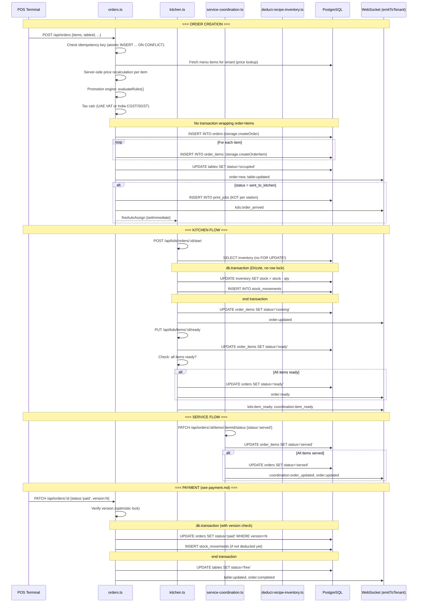

# Flow 2 — Order Lifecycle

## Narrative

An order begins at the POS when a waiter selects items for a table. The server recalculates all prices server-side (never trusting client), runs the promotion engine, computes tax (VAT or GST), and inserts the order + items — **without a wrapping transaction**. A KOT is generated per kitchen station. The kitchen acknowledges and starts cooking, which triggers stock deduction. Items progress through `pending -> cooking -> ready -> served`. Once all items are served and payment is complete, the table is freed. Optimistic locking (`version` column) is used on the main order update endpoint but is absent from coordination and KDS endpoints.

## Sequence Diagram

## Files Involved (in order)

| Step | File | Function / Line | DB Table(s) |
|------|------|----------------|-------------|
| Idempotency check | `server/routers/orders.ts` | Lines 322-370 | `idempotency_keys` |
| Price recalculation | `server/routers/orders.ts` | Lines 414-499 | `menu_items`, `outlet_menu_prices` (read) |
| Promotion evaluation | `server/promotions-engine.ts` | `evaluateRules()` | `promotion_rules` (read) |
| Tax calculation | `server/routers/orders.ts` | Lines 504-562 | `tenants` (read) |
| Order insert | `server/storage.ts` | `createOrder()` :1161 | `orders` (insert) |
| Items insert (loop) | `server/storage.ts` | `createOrderItem()` | `order_items` (insert) |
| Table update | `server/routers/orders.ts` | Line 687-689 | `tables` (update) |
| KOT creation | `server/routers/orders.ts` | Lines 699-744 | `print_jobs` (insert) |
| KDS start / stock deduction | `server/routers/kitchen.ts` | Lines 221-408 | `inventory_items`, `stock_movements` (tx) |
| Item status update | `server/routers/kitchen.ts` | Lines 74-119 | `order_items` (update) |
| Order status propagation | `server/routers/kitchen.ts` | Lines 94-99 | `orders` (update) |
| Coordination status | `server/routers/service-coordination.ts` | Lines 68-137 | `orders` (update) |
| Order update (payment) | `server/routers/orders.ts` | Lines 829-995 | `orders`, `inventory_items`, `stock_movements` (tx) |
| Table free | `server/routers/orders.ts` | Lines 1054-1065 | `tables` (update) |

## tenant_id Checks

| Operation | tenant_id Checked | Notes |
|-----------|-------------------|-------|
| Order creation | Yes | `user.tenantId` from session |
| Order items creation | Implicit | Items inherit from order |
| Table status update | Implicit | Table fetched by ID (no tenant check on UPDATE, but table was fetched with tenant scope earlier) |
| KDS item status | Yes | Fetches item, verifies order.tenantId matches |
| Coordination status | Yes | `WHERE id = $1 AND tenant_id = $2` |
| **Transfer table** | **NO** | orders.ts:1265 — no tenant_id in WHERE |
| **Merge tables** | **NO** | orders.ts:1295-1305 — no tenant_id in WHERE |
| **Split bill** | **NO** | orders.ts:1331 — no tenant_id in WHERE |

## Transactions / Atomicity

| Operation | Transaction | Notes |
|-----------|-------------|-------|
| Order + items creation | **NO** | Order and items inserted separately |
| Stock deduction (KDS start) | Yes (Drizzle tx) | But NO `SELECT FOR UPDATE` — race condition on stock reads |
| Stock deduction (recipe path) | Yes (raw SQL tx) | Proper `SELECT FOR UPDATE` — gold standard |
| Order status + stock deduction on payment | Yes (Drizzle tx) | With version check |
| Table freeing after payment | **NO** | Outside the payment transaction |
| Item status + order status propagation | **NO** | Separate DB calls |

## Findings

| ID | Severity | Description | File:Line |
|----|----------|-------------|-----------|
| F-031 | Critical | Transfer-table endpoint has no tenant_id check — cross-tenant order access | orders.ts:1265 |
| F-032 | Critical | Merge-tables endpoint has no tenant_id check — cross-tenant order mutation | orders.ts:1295-1305 |
| F-033 | Critical | Split-bill endpoint has no tenant_id check — cross-tenant data read | orders.ts:1331 |
| F-034 | Critical | Coordination status update (`PATCH /api/orders/:id/status`) has no optimistic locking AND no status transition validation — any status can be set | service-coordination.ts:68-137 |
| F-035 | High | Order creation is NOT wrapped in a transaction — partial item insertion on crash | orders.ts:590-689 |
| F-036 | High | No guard against concurrent orders for the same table — two orders can occupy one table | orders.ts:687-689 |
| F-037 | High | KDS stock deduction uses Drizzle tx without `SELECT FOR UPDATE` — race condition on concurrent deductions | kitchen.ts:274-281 |
| F-038 | High | Selective item start deducts inventory fire-and-forget — failure silently ignored | kitchen.ts:734-737 |
| F-039 | Medium | No optimistic locking on order_items — concurrent KDS updates are last-write-wins | (no version column on order_items) |
| F-040 | Medium | Table freeing on payment is outside the transaction — crash leaves table occupied | orders.ts:1054-1057 |
| F-041 | Medium | No status transition state machine enforced on main order PATCH | orders.ts:797 |
