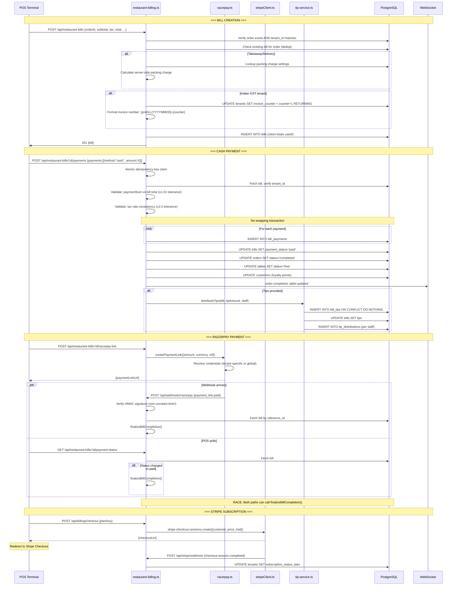

# Flow 3 — Payment Flow

## Narrative

When an order is ready for payment, the POS creates a bill via `POST /api/restaurant-bills`, which **trusts client-submitted totals** (subtotal, tax, discount, service charge, tips). The server only adds packing charges for takeaway orders and generates an invoice number for Indian GST tenants. Payment is recorded via `POST /api/restaurant-bills/:id/payments` with an idempotency key. The server validates payment sums against stored bill totals but the bill itself may have been created with tampered values. Split payments iterate individually without a transaction. For Razorpay, a payment link is created and completion is handled by both webhook and polling — creating a double-finalization race.

## Sequence Diagram

## Files Involved

| Step | File | Function / Line | DB Table(s) |
|------|------|----------------|-------------|
| Bill creation | `server/routers/restaurant-billing.ts` | Lines 209-371 | `bills` (insert), `bill_packing_charges` |
| Invoice counter | `server/routers/restaurant-billing.ts` | Lines 297-301 | `tenants` (atomic update) |
| Payment recording | `server/routers/restaurant-billing.ts` | Lines 373-700 | `bill_payments`, `bills`, `orders`, `tables`, `customers` |
| Idempotency | `server/routers/restaurant-billing.ts` | Lines 395-419 | `idempotency_keys` |
| Payment validation | `server/routers/restaurant-billing.ts` | Lines 421-495 | — (in-memory) |
| Tip distribution | `server/services/tip-service.ts` | Lines 1-168 | `bill_tips`, `bills`, `tip_distributions` |
| Razorpay link | `server/razorpay.ts` | `createPaymentLink()` | Razorpay API |
| Razorpay webhook | `server/index.ts` | Lines 65-106 | `bills`, `bill_payments`, `orders` |
| Razorpay verify | `server/razorpay.ts` | `verifyWebhookSignature()` :108-113 | — |
| Bill completion | `server/routers/restaurant-billing.ts` | `finalizeBillCompletion()` :48-122 | `bills`, `bill_payments`, `orders`, `tables`, `customers` |
| Stripe checkout | `server/routers/billing.ts` | Lines 67-115 | Stripe API |
| Stripe webhook | `server/index.ts` | Lines 42-62 | `stripe.*` schema |
| Cash calculator | `server/services/cash-calculator.ts` | Lines 1-68 | — |
| Void bill | `server/routers/restaurant-billing.ts` | Lines 702-801 | `bills`, `orders`, `inventory_items`, `stock_movements` |
| Refund | `server/routers/restaurant-billing.ts` | Lines 803-955 | `bill_payments`, `bills` + Razorpay API |

## tenant_id Checks

| Operation | tenant_id Checked | Method |
|-----------|-------------------|--------|
| Bill creation | Yes | `storage.getOrder(orderId, user.tenantId)` |
| Payment recording | Yes | `WHERE id = $1 AND tenant_id = $2` on bill fetch |
| Razorpay webhook | Implicit | Bill looked up by `reference_id` (order ID), tenant derived from bill |
| Void | Yes | `requireRole(owner, manager)` + tenant scoped query |
| Refund | Yes | Tenant scoped query |
| Public receipt | **No auth** | Bill looked up by UUID (acceptable — UUID is unguessable) |

## Transactions / Atomicity

| Operation | Transaction | Risk |
|-----------|-------------|------|
| Bill creation | **NO** | Packing charge insert is fire-and-forget |
| Payment recording (per-payment inserts) | **NO** | Crash between payment insert and bill status update |
| finalizeBillCompletion() | **NO** | 6+ sequential DB writes, any can fail |
| Invoice number generation | Yes (atomic UPDATE RETURNING) | Safe |
| Bill number generation | Yes (Drizzle tx with retry) | Safe |
| Void (stock reversal) | **NO** | Partial reversal possible |
| Refund (Razorpay API + local) | **NO** | Gateway refund succeeds but local record fails |

## Findings

| ID | Severity | Description | File:Line |
|----|----------|-------------|-----------|
| F-042 | High | Bill totals (subtotal, tax, discount, total) trusted from client at creation — no server recalculation | restaurant-billing.ts:212-213,310-312 |
| F-043 | High | Payment recording not transactional — crash between payment insert and bill status update | restaurant-billing.ts:518-570 |
| F-044 | High | Razorpay webhook + polling double-finalization race — duplicate payments and loyalty points | index.ts:85-97 + restaurant-billing.ts:1186-1198 |
| F-045 | High | Razorpay HMAC verification uses `===` (non-constant-time) — susceptible to timing attack | razorpay.ts:113 |
| F-046 | High | No IGST support — only CGST/SGST for Indian GST; non-compliant for inter-state transactions | restaurant-billing.ts:281-303 |
| F-047 | Medium | Payment sum tolerance of ±1.01 currency units — generous for high-value currencies | restaurant-billing.ts:437 |
| F-048 | Medium | Split payment race — no bill-level lock prevents concurrent payments exceeding total | restaurant-billing.ts:518-570 |
| F-049 | Medium | Tip accumulation race on concurrent split payments — tips can double | restaurant-billing.ts:574 |
| F-050 | Medium | Razorpay webhook secret is global, not per-tenant — tenant A can forge events for tenant B | razorpay.ts:111 |
| F-051 | Medium | Invoice numbers only generated for Indian GST, not UAE VAT — non-compliant with UAE FTA regulations | restaurant-billing.ts:281 |
| F-052 | Medium | Tip pool distribution rounding shortfall — `100 / 3 = 33.33 * 3 = 99.99` | tip-service.ts:107 |
| F-053 | Medium | Refund not transactional — Razorpay refund can succeed while local DB record fails | restaurant-billing.ts:803-955 |
| F-054 | Medium | Platform Stripe secret key stored in `platform_settings` DB table — DB compromise exposes key | stripe.ts:10 |
