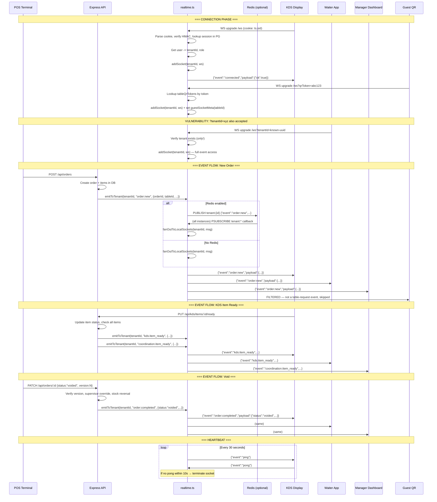

# Flow 4 — Real-Time Sync

## Narrative

When a POS action occurs (new order, status change, void), the server emits a WebSocket event to all connected sockets for that tenant. Events are scoped by tenant_id via a `tenantSockets` Map. When Redis is configured, events are published to a `tenant:{id}` channel for multi-instance fan-out. Guest sockets (QR) receive only `table-request:*` events for their specific table. There is no per-user or per-role filtering on standard events — every socket in the tenant sees every event (financial data, order details, alerts). A critical gap exists: the WebSocket accepts `?tenantId=` connections with no session authentication.

## Sequence Diagram

## Files Involved

| Component | File | Function / Line |
|-----------|------|----------------|
| WS server setup | `server/realtime.ts` | `setupWebSocket()` :151-312 |
| Session-based auth | `server/realtime.ts` | `getTenantFromRequest()` :71-107 |
| Wall screen auth | `server/realtime.ts` | Lines 187-188 |
| QR token auth | `server/realtime.ts` | Lines 189-195 |
| **Bare tenantId auth** | `server/realtime.ts` | Lines 196-199 |
| Socket tenant map | `server/realtime.ts` | `addSocket()` / `removeSocket()` :29-36 |
| Event broadcast | `server/realtime.ts` | `emitToTenant()` :59-69 |
| Manager-only broadcast | `server/realtime.ts` | `emitToTenantManagers()` :114-132 (UNUSED) |
| Guest filtering | `server/realtime.ts` | `fanOutToLocalSockets()` :38-57 |
| Redis pub/sub | `server/services/pubsub.ts` | `publish()`, `psubscribe()` |
| Redis fan-out | `server/realtime.ts` | `setupRedisPubSub()` :136-149 |
| Heartbeat sweep | `server/realtime.ts` | Lines 259-298 |

## tenant_id Checks

| Connection Method | Auth Level | tenant_id Source |
|-------------------|------------|-----------------|
| Session cookie (ts.sid / connect.sid) | Full session auth | User lookup -> user.tenantId |
| `?token=` (wall screen) | Token lookup | `tenants.wallScreenToken` match |
| `?qrToken=` (guest) | Token lookup | `tableQrTokens.tenantId` |
| **`?tenantId=`** | **Existence check only** | **Client-supplied, verified to exist** |

## Transactions / Atomicity

Not applicable — WebSocket is a broadcast layer. No DB writes in the WS path itself.

## Event Filtering Analysis

| Audience | Events Received | Filtering |
|----------|----------------|-----------|
| Authenticated staff | ALL 73 event types | None — all events broadcast to all sockets |
| Guest (QR) | Only `table-request:*` | Filtered by `guestSocketMeta.tableId` |
| Manager-only | Intended for `account_sharing_alert` | `emitToTenantManagers()` defined but **never called** |

**Consequence:** A waiter's socket receives security alerts, circuit breaker events, all void requests, all billing events, wastage alerts, and all coordination messages for the entire tenant. There is no role-based event filtering.

## Findings

| ID | Severity | Description | File:Line |
|----|----------|-------------|-----------|
| F-055 | High | WebSocket accepts `?tenantId=` with no session auth — only checks tenant exists; grants full event stream to any party who knows a tenant UUID | realtime.ts:196-199 |
| F-056 | Medium | No role-based WebSocket event filtering — all 73 event types broadcast to all tenant sockets (waiter sees security alerts, financial data, void details) | realtime.ts:38-57 |
| F-057 | Medium | `emitToTenantManagers()` built for role-filtered delivery but never called — account sharing alerts use `alert:trigger` via the generic broadcast instead | realtime.ts:114-132, alert-engine.ts:47 |
| F-058 | Low | Wall screen token (`?token=`) is a static bearer token stored in `tenants.wallScreenToken` — if leaked, provides permanent WS access until manually rotated | realtime.ts:187-188 |
