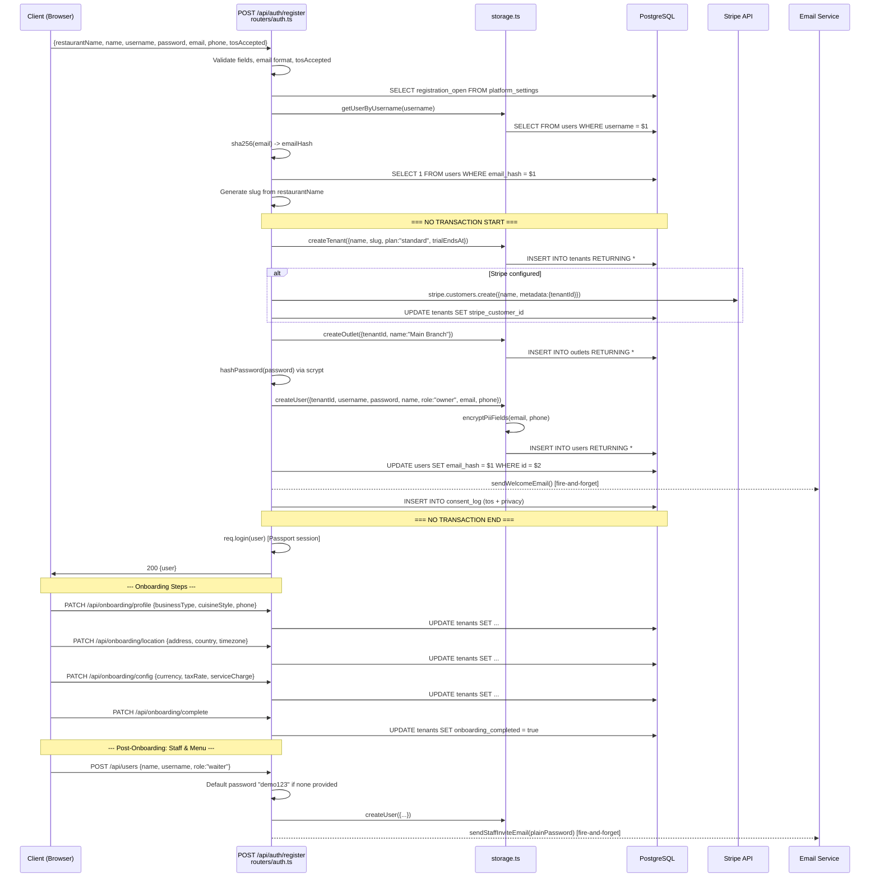

# Flow 1 — Tenant Signup and Onboarding

## Narrative

A new restaurant owner registers via `POST /api/auth/register`. The server creates a tenant, a default outlet ("Main Branch"), and an owner user account in sequence — **without a wrapping transaction**. Stripe customer creation is attempted but non-fatal. After registration, the owner completes onboarding steps (profile, location, currency/tax config, outlet name) via PATCH endpoints in `billing.ts`, then marks onboarding complete. Staff and additional outlets are created post-onboarding.

## Sequence Diagram

## Files Involved (in order)

| Step | File | Function / Line | DB Table |
|------|------|----------------|----------|
| Validate input | `server/routers/auth.ts` | Lines 22-35 | — |
| Registration gate | `server/routers/auth.ts` | Lines 37-42 | `platform_settings` (read) |
| Username uniqueness | `server/storage.ts` | `getUserByUsername()` :936-938 | `users` (read) |
| Email hash uniqueness | `server/routers/auth.ts` | Lines 49-56 | `users` (read) |
| Create tenant | `server/storage.ts` | `createTenant()` :920-922 | `tenants` (insert) |
| Stripe customer | `server/routers/auth.ts` | Lines 62-73 | Stripe API + `tenants` (update) |
| Create outlet | `server/storage.ts` | `createOutlet()` :962-964 | `outlets` (insert) |
| Hash password | `server/auth.ts` | `hashPassword()` :49-53 | — |
| Encrypt PII | `server/storage.ts` | `encryptPiiFields()` :941 | — |
| Create user | `server/storage.ts` | `createUser()` :940-943 | `users` (insert) |
| Email hash persist | `server/routers/auth.ts` | Lines 87-92 | `users` (update) |
| Consent log | `server/routers/auth.ts` | Lines 95-115 | `consent_log` (insert x2) |
| Session | `server/routers/auth.ts` | Lines 116-120 | `session` (insert) |
| Onboarding steps | `server/routers/billing.ts` | Lines 10-65 | `tenants`, `outlets` (update) |
| Staff creation | `server/routers/users.ts` | Lines 33-81 | `users` (insert) |

## tenant_id Checks

| Operation | tenant_id Source | Verified |
|-----------|-----------------|----------|
| Tenant creation | Generated server-side (gen_random_uuid) | Yes |
| Outlet creation | From newly created tenant.id | Yes |
| User creation | From newly created tenant.id | Yes |
| Onboarding updates | From req.user.tenantId (session) | Yes |
| Staff creation | From req.user.tenantId (session) | Yes |

## Transactions / Atomicity

**None.** The entire registration flow (5+ DB writes across 4 tables) has no transaction. Partial failure creates orphan records.

## Findings

| ID | Severity | Description | File:Line |
|----|----------|-------------|-----------|
| F-022 | Critical | No transaction wrapping registration — tenant/outlet/user creation can leave orphans on partial failure | auth.ts:58-119 |
| F-023 | Critical | Owner can self-set `plan` field via `PATCH /api/tenant`, bypassing Stripe billing entirely | tenant.ts:35,47 |
| F-024 | High | No password policy enforced at registration — `validatePasswordPolicy` imported but never called | auth.ts:76 |
| F-025 | High | Onboarding PATCH endpoints use `requireAuth` only (no role check) — any staff member can modify tenant settings | billing.ts:16-65 |
| F-026 | High | Default staff password "demo123" when none provided; plaintext password sent via email | users.ts:49,66 |
| F-027 | High | No UNIQUE constraint on `email_hash` column — concurrent duplicate emails bypass app-layer check | schema.ts:168 |
| F-028 | Medium | No input validation on currency (not ISO 4217), taxRate, serviceCharge during onboarding | billing.ts:38-47 |
| F-029 | Medium | Duplicate onboarding-complete endpoints with different auth levels (PATCH owner-only vs POST any-auth) | onboarding.ts:6 vs billing.ts:61 |
| F-030 | Medium | Slug uniqueness enforced by DB only — no app-level check, no retry, unhelpful 500 on collision | auth.ts:58-60 |
