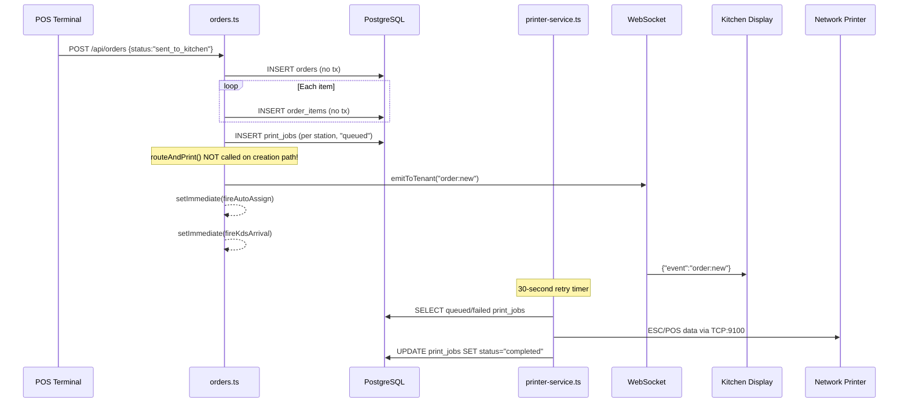
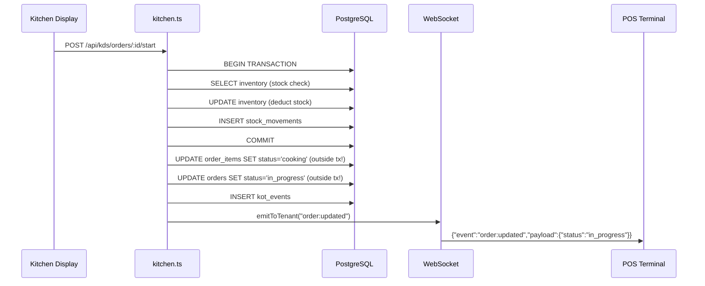

# Phase 6 — Real-time Layer Audit

**Date:** 2026-04-15
**Scope:** WebSocket lifecycle, client/server protocol, event delivery, KOT flow, print routing, Redis pub/sub, failure modes.

---

## 1. WebSocket Connection Lifecycle

**Server:** `server/realtime.ts` — raw `ws` library, `noServer: true`
**Client:** `client/src/hooks/use-realtime.ts` — singleton `RealtimeClient` class
**Endpoint:** `wss://<host>/ws` (upgrade handler at realtime.ts:157-166)

### Handshake

```
Client                          Server (httpServer.on('upgrade'))
  |-- HTTP GET /ws (Upgrade) -->|
  |    Cookie: ts.sid=...       |-- Parse cookie, verify HMAC
  |                             |-- Lookup session in PG (session table)
  |                             |-- Get userId from session.passport.user
  |                             |-- Lookup user -> tenantId, role
  |<-- 101 Switching Protocols  |
  |<-- {"event":"connected"}    |-- addSocket(tenantId, ws)
```

### Auth on Connect (realtime.ts:71-207)

| Priority | Method | Credential | Validation | tenant_id Source |
|----------|--------|------------|------------|-----------------|
| 1 | Session cookie | `ts.sid` or `connect.sid` | HMAC-SHA256 verify → PG session lookup → user lookup | `user.tenantId` (DB) |
| 2 | `?token=` | Wall screen token | `storage.getTenantByWallScreenToken(token)` | `tenant.id` (DB) |
| 3 | `?qrToken=` | QR table token | `storage.getQrTokenByValue(token)` — verifies `active` flag | `tableToken.tenantId` (DB) |
| **4** | **`?tenantId=`** | **Raw UUID** | **`storage.getTenant(rawId)` — only checks existence** | **Client-supplied** |
| Fail | None | — | `ws.close(4001, "Unauthorized")` | — |

### Room/Channel Model

No explicit rooms or channels. The server maintains a `Map<tenantId, Set<WebSocket>>` called `tenantSockets`. All sockets in a tenant's set receive all events for that tenant. Guest sockets are tracked via a `WeakMap<WebSocket, { tableId }>` and filtered in `fanOutToLocalSockets()` to only receive `table-request:*` events matching their table.

### Disconnection

- `ws.on("close")` → `removeSocket(tenantId, ws)`
- `ws.on("error")` → `removeSocket(tenantId, ws)`
- Server heartbeat sweep (every 30s): sends `{"event":"ping"}`, sets 10s deadline timer. If no pong received → `ws.terminate()`

---

## 2. Client WebSocket Implementation

**File:** `client/src/hooks/use-realtime.ts`

### Connection

```typescript
const proto = window.location.protocol === "https:" ? "wss:" : "ws:";
this.ws = new WebSocket(`${proto}//${window.location.host}/ws`);
```

The client connects with **no explicit token or query parameters** — it relies entirely on the session cookie (automatically sent by the browser during the WebSocket upgrade). This is the correct and secure path.

### Reconnection

| Parameter | Value |
|-----------|-------|
| Initial delay | 1000ms |
| Max delay | 30000ms |
| Backoff | Exponential (`delay * 2`) |
| Max attempts | 10 (`MAX_RECONNECT_ATTEMPTS`) |
| Fast retry on 1006 | 1000ms (server crash) |

After 10 failed reconnects, `maxAttemptsReached = true` and no further attempts are made. The `RealtimeStatusBanner` component shows a "connection lost" indicator.

### Heartbeat (Client Side)

Client sends `{"event":"ping"}` every **25 seconds** (line 38). Server responds with `{"event":"pong"}`. Server also sends its own `{"event":"ping"}` every **30 seconds**, and the client responds with `{"event":"pong"}` (line 111).

### Message Handling

```typescript
ws.onmessage = (evt) => {
  const { event, payload } = JSON.parse(evt.data);
  if (event === "ping") { ws.send(JSON.stringify({ event: "pong" })); return; }
  if (event === "pong") return;
  const handlers = this.listeners.get(event);
  if (handlers) handlers.forEach(h => h(payload));
};
```

**No deduplication.** If the same event is received twice (e.g., network retry causing server to re-emit), every handler fires twice. There is no event ID, sequence number, or idempotency check on the client.

### Singleton Pattern

`const realtimeClient = new RealtimeClient()` — one global instance. All React components share it via `useRealtimeEvent()`. Good — prevents connection storms from multiple components.

### Guest WebSocket (table-qr.tsx:322-349)

Separate from the main `RealtimeClient`. Connects with `?qrToken=` parameter:
```typescript
ws = new WebSocket(`${proto}//${window.location.host}/ws?qrToken=${encodeURIComponent(qrToken)}`);
```
Same exponential backoff reconnection. No max attempt limit (reconnects indefinitely).

---

## 3. F-016 / F-136 Deep Exploitability Analysis

### F-016: WebSocket `?tenantId=` (realtime.ts:196-199)

**Verified exploitable.** An attacker who knows any tenant UUID can:

1. Open a WebSocket: `wss://inifinit.com/ws?tenantId=<UUID>`
2. No cookie, no auth, no rate limit on connections
3. Receive ALL 73 event types for that tenant in real-time

**Data exposed:**
- `order:new` — full order details (items, prices, table, waiter name, customer name/phone for delivery)
- `order:updated` / `order:completed` — status changes, payment status
- `kds:item_ready` / `kds:item_started` — chef names, counter names, item details
- `cash_session:opened` / `cash_session:payment` / `cash_session:closed` — running cash balances
- `alert:trigger` — security alerts (account sharing, rate anomalies)
- `security_alert` — security events
- `void_request:new` / `void_request:approved` — void details with amounts
- `bill:updated` — billing details
- `stock:updated` — inventory levels
- `wastage:*` — wastage data with costs

**Tenant UUID discoverability:**
- Guest QR URLs likely contain outlet IDs (UUIDs), not tenant IDs directly
- However, `GET /api/guest/menu/:outletId` returns data that could leak the tenant ID
- Wall screen tokens are rotatable but if leaked, the `?token=` path gives the same access
- The frontend never uses `?tenantId=` — this is an unintended backdoor

**Attack:** Passive eavesdropping on a restaurant's entire real-time operation. No write access (WS is receive-only from server), but complete visibility into orders, payments, cash, staffing, and security events.

### F-136: KDS Wall Tickets (`GET /api/kds/wall-tickets?tenantId=`)

**Verified exploitable.** An attacker who knows any tenant UUID can:

1. Send: `GET /api/kds/wall-tickets?tenantId=<UUID>`
2. No cookie, no auth, no rate limit
3. Receive a JSON array of ALL active orders with:
   - Order details (orderNumber, orderType, status, tableId, waiterId, waiterName)
   - Full order items (name, quantity, price, modifiers, station, course, status)
   - Table numbers
   - Chef assignment details (chefName, counterName, counterId, assignmentStatus)

**Compared to F-016:** This is a REST endpoint, not WebSocket, so it returns a point-in-time snapshot rather than a live stream. But it's trivially scriptable (poll every few seconds) and returns richer data per call (full item details with prices).

**Both F-016 and F-136 are confirmed exploitable** given a known tenant UUID. The tenant UUID is the only barrier, and UUIDs may be discoverable.

---

## 4. Connection Limits and DoS Resilience

### Server-Side Limits

| Limit | Implementation | Value |
|-------|---------------|-------|
| Max connections per tenant | **None** | Unlimited |
| Max connections per user | **None** | Unlimited |
| Max connections per IP | **None** | Unlimited |
| Max total connections | **None** (limited only by OS/memory) | Unlimited |
| Connection rate limit | **None** | Unlimited |
| Message size limit | **None** (ws default: unlimited) | Unlimited |

### Reconnection Storm Risk

If the server restarts, all connected clients receive close code 1006 and immediately retry with 1000ms delay. With N clients:
- t=0: Server starts
- t=1s: All N clients attempt reconnect simultaneously
- Each connection triggers: cookie parse → HMAC verify → PG session query → user lookup

For a deployment with 50 concurrent tenants × 5 devices each = 250 simultaneous reconnections hitting the PG session table. No connection throttling or staggered backoff on the server side.

### Fan-Out Risk

`emitToTenant()` iterates all sockets in `tenantSockets.get(tenantId)` and calls `ws.send()` synchronously for each. A tenant with many connected clients (e.g., large franchise with 100+ devices) creates blocking fan-out on every event. No batching, no async iteration.

---

## 5. Authorization on Emit

**No per-event authorization.** The server trusts that if a socket was added to `tenantSockets[tenantId]` at connection time, it may receive all events for that tenant forever.

| Event Type | Contains Sensitive Data | Who Should See It | Who Actually Sees It |
|------------|----------------------|-------------------|---------------------|
| `security_alert` | IP addresses, anomaly details | Owner, Manager | **All tenant sockets** |
| `cash_session:*` | Cash balances, payout amounts | Owner, Manager, Cashier | **All tenant sockets** |
| `void_request:*` | Void amounts, reasons | Owner, Manager | **All tenant sockets** |
| `alert:trigger` | Alert messages, staff names | Owner, Manager | **All tenant sockets** |
| `bill:updated` | Bill amounts | Owner, Manager, Cashier | **All tenant sockets** |
| `wastage:*` | Wastage costs, chef names | Owner, Manager | **All tenant sockets** |
| `circuit_breaker:open` | System operational state | Owner, Super Admin | **All tenant sockets** |
| `order:new` | Customer names/phones (delivery) | POS staff | **All tenant sockets** |
| `table-request:*` | Request details | Staff + specific guest table | Filtered for guests, unfiltered for staff |

`emitToTenantManagers()` exists (realtime.ts:114-132) for role-filtered delivery but is **never called** from any router. All events use the unfiltered `emitToTenant()`.

---

## 6. KOT (Kitchen Order Ticket) Flow

### POS → Kitchen Path



### Kitchen → POS Acknowledgment



### Data Persistence Between Hops

| Hop | Data Persisted | Table | Gap |
|-----|---------------|-------|-----|
| POS → DB | Order + items | `orders`, `order_items` | Not transactional — partial items possible |
| DB → Print Queue | Print job record | `print_jobs` | Created in DB but physical print delayed on creation path |
| Print Queue → Printer | ESC/POS data sent via TCP | (volatile) | 3 max attempts, then abandoned silently |
| POS → KDS (via WS) | Event payload | (not persisted) | Fire-and-forget — lost if KDS disconnected |
| KDS → DB | Status change | `order_items`, `orders` | Item update outside stock deduction transaction |

---

## 7. WebSocket Failure Modes

### Server Crash

- All connections drop with close code 1006
- Client retries after 1000ms (fast retry for 1006)
- Max 10 attempts with exponential backoff
- **Events emitted between crash and reconnect are permanently lost**
- After reconnect, client gets future events only — no replay of missed events

### Network Disconnect (Client)

- Client detects via `onclose` event
- Reconnects with exponential backoff (1s → 2s → 4s → ... → 30s max)
- **All events during disconnect are lost**
- No offline queue, no sequence numbers, no catch-up mechanism

### Redis Pub/Sub Failure (Multi-Instance)

- If Redis goes down, `publish()` catches the error and logs it (pubsub.ts:54-57)
- Events are **silently dropped** — not delivered to other instances
- No fallback to local-only delivery (the EventEmitter path only runs when `!isRedisEnabled()`)
- Once Redis recovers, new events flow normally — but the gap is permanent

### Graceful Shutdown (server/index.ts:746-781)

- HTTP server closes (stops new connections)
- All WS clients sent close frame (1001, "Server shutting down")
- 500ms wait, then forceful terminate
- DB pool drained
- **Good:** Clients receive proper close code and can reconnect to another instance

---

## 8. Replay and Duplicate Handling

### Server Side

- **No event IDs.** Events are `{ event: string, payload: object }` with no sequence number, timestamp, or unique ID.
- **No exactly-once delivery.** `emitToTenant` iterates sockets and calls `ws.send()`. If a network ACK is lost and the client's TCP stack retransmits, the message may arrive twice. The `ws` library handles TCP-level dedup, but application-level retries (e.g., server emitting the same event from multiple code paths) have no guard.
- **Duplicate emit risk:** Some code paths emit the same logical event from multiple locations (e.g., `order:updated` from both `orders.ts` and `service-coordination.ts`).

### Client Side

- **No deduplication.** The `RealtimeClient.onmessage` handler dispatches to all registered handlers for the event name. No event ID check, no "already processed" set.
- **Impact:** A duplicate `order:new` event would cause the POS to show the order twice (until the next data refresh). A duplicate `cash_session:payment` could show an incorrect running balance. Most handlers trigger React Query `refetch()` which is idempotent (re-fetches from DB), mitigating the visual impact.

---

## 9. Redis Pub/Sub

**File:** `server/services/pubsub.ts`

### Architecture

```
Instance A                          Redis                         Instance B
  |-- PUBLISH tenant:X msg -->    [tenant:X]    <-- PSUBSCRIBE tenant:* --|
                                                --> handler(channel, msg) --|
                                                --> fanOutToLocalSockets() --|
```

### Tenant Scoping

- **Channel pattern:** `tenant:{tenantId}` (set in realtime.ts:63)
- **Subscription:** `psubscribe("tenant:*")` (realtime.ts:140) — subscribes to ALL tenants
- **Delivery:** `fanOutToLocalSockets(tenantId, ...)` only delivers to sockets in that tenant's set
- **Assessment:** Channel naming is correctly tenant-scoped. Cross-tenant delivery is prevented by the socket registration model, not by Redis channel access control.

### Fallback Mode

When `REDIS_URL` is not set:
- `publish()` → `localEmitter.emit(channel, msg)` — same-process only
- `psubscribe("tenant:*")` → `localEmitter.on("tenant:*", handler)` — **BUG**: EventEmitter does not support wildcard/pattern matching. The handler is registered for the literal string `"tenant:*"`, but `emit("tenant:abc123")` won't match it.
- **Impact:** In local mode without Redis, the `psubscribe` path at realtime.ts:140 **never receives messages**. However, `emitToTenant()` (realtime.ts:66) falls through to `fanOutToLocalSockets()` directly when `!isRedisEnabled()`. So events still work in single-instance mode, but the pubsub module's local fallback for `psubscribe` is broken.

---

## 10. Summary of Findings

| ID | Severity | Description | File:Line |
|----|----------|-------------|-----------|
| F-166 | High | No connection limits (per-tenant, per-user, per-IP, global) on WebSocket — unlimited connections enable DoS | realtime.ts:172+ |
| F-167 | High | No `routeAndPrint()` called on direct order creation with `sent_to_kitchen` status — physical print delayed up to 30s until retry worker | orders.ts:699-743 |
| F-168 | High | No crash recovery for KOTs — if server crashes between order creation and print job creation, kitchen never gets notified; no startup reconciliation job | orders.ts:592-743 |
| F-169 | High | Print jobs abandoned after 3 failed attempts with no alerting, no dead-letter queue, no user notification | printer-service.ts:172,708 |
| F-170 | Medium | No event deduplication on client or server — duplicate events can cause UI glitches (double orders, incorrect balances) | use-realtime.ts:105-117 |
| F-171 | Medium | No offline event delivery or catch-up — events during WS disconnect are permanently lost, no sequence numbers | realtime.ts (entire architecture) |
| F-172 | Medium | Reconnection storm: all clients retry simultaneously after server restart with only 1s delay — no server-side throttling or client jitter | use-realtime.ts:135, realtime.ts:172 |
| F-173 | Medium | Redis pub/sub local fallback `psubscribe` is broken — EventEmitter doesn't support wildcard patterns; only works because `emitToTenant` bypasses pubsub in local mode | pubsub.ts:83 |
| F-174 | Medium | Duplicate print job records — route-level `storage.createPrintJob()` AND `routeAndPrint()` both insert into `print_jobs` for the same order | orders.ts:706 + printer-service.ts:308 |
| F-175 | Medium | `getNextKotSequence()` uses read-then-write without locking — duplicate KOT sequence numbers under concurrency | print-jobs.ts:14-18 |
| F-176 | Medium | Stock deduction in KDS start is transactional but item status updates and order status update are outside the transaction | kitchen.ts:272 vs 317-323 |
| F-177 | Low | Retry worker only handles NETWORK_IP printers — USB/BLUETOOTH/CLOUD print jobs stuck in "queued" forever on failure | printer-service.ts:716 |
| F-178 | Low | Cloud printer handler is a stub (`console.log` only) — jobs routed to cloud printers silently succeed without printing | printer-service.ts:76-80 |
| F-179 | Low | `fireAutoAssign` and `fireKdsArrival` swallow all errors silently (`.catch(() => {})`) — chef assignment and timing failures invisible | orders.ts:28,84-85 |
